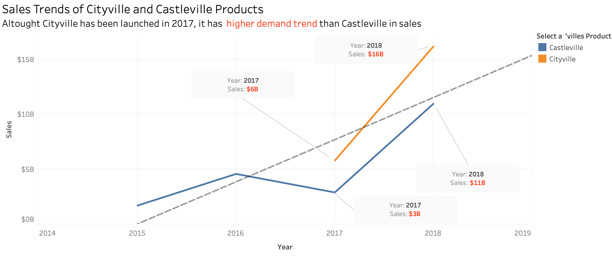
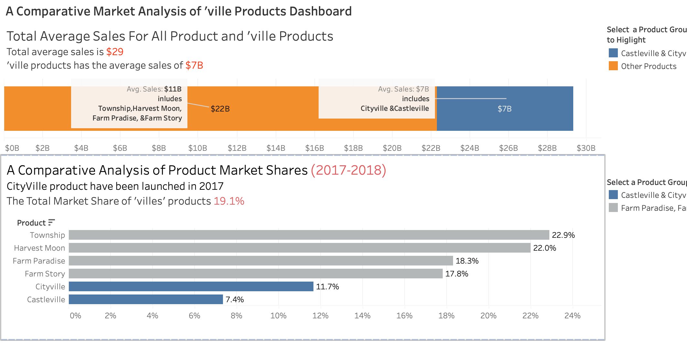

# Ville-Products-Market-Analysis

Overview:  
This repository contains the Tableau project for the MIS 505 Data Visualization course. The project demonstrates an analysis of market performance for Ville Products, showcasing interactive dashboards and visualizations created in Tableau. Its primary goal is to display effective data visualization techniques and extract insights from the market data.

Table of Contents:  
• Project Overview  
• Results 
• Tableau Workbook  
• Installation and Usage  
• Data Sources and Methodology  
• Course Context  
• Contributing   
• Contact

Project Overview:  
The Ville Products Market Analysis project provides an extensive view of market trends, product performance, and customer behavior. Key elements include:
– Market Trends: Analyzing sales trends over time.  
– Product Analysis: Comparing product performance metrics.  
– Geographical Insights: Visualizing regional sales and customer distribution.  
– Interactive Dashboards: Enabling dynamic exploration of the data.

Results:

Chart 1: Sales Trends of Cityville and Castleville Products
What You See:

A line chart plotting annual sales from 2015 to 2019 (vertical axis in billions of dollars; horizontal axis in years).

Two products are shown: Cityville (blue line) and Castleville (orange line).

Cityville’s sales data begins in 2017 (because it was launched that year), whereas Castleville has data from 2015 onward.

The dashed line from 2018 to 2019 suggests a forecast or projected values.

Key Observations:

Late Entry, Rapid Growth:
Cityville enters the market in 2017 but quickly surpasses Castleville’s sales by 2018. This suggests a strong initial demand and rapid adoption.

Comparison with Castleville:

Castleville has a longer track record (available since 2015) with a steady or moderate rise in sales.

Despite Castleville’s head start, Cityville’s sales trajectory jumps significantly within a year.

High Demand Trend:
The orange line (Castleville) continues to grow, but at a slower pace compared to Cityville’s steeper upward trend. By 2018, Cityville’s sales ($1.6B) outpace Castleville’s ($1.3B).

Overall Significance:

Market Disruption: A newly launched product (Cityville) can disrupt the market if it resonates well with consumers or addresses an unmet need.

Potential for Continued Growth: The forecasted dashed line hints Cityville’s momentum might continue, indicating strong future performance relative to Castleville.

Chart 2: A Comparative Market Analysis of Ville Products Dashboard
This dashboard combines multiple views:

A bar/stacked bar chart showing total average sales for all products vs. Ville products.

A horizontal bar chart comparing product market shares in 2017-2018.

Part A: Total Average Sales
Total average sales: $29 (units unspecified, could be billions or a different measure).

Average sales of ‘ville’ products: $78, indicating these products tend to generate higher revenue on average compared to the broader set of products.

Interpretation:

The higher average ($78) for ‘ville’ products points to either stronger pricing, stronger brand recognition, or higher demand.

The stacked bar indicates that among different product categories (e.g., Township, Harvest Moon, Farm Paradise, Farm Story), Cityville and Castleville together contribute a significant portion ($7B in the visual breakdown).

Part B: Comparative Analysis of Product Market Shares (2017-2018)
Text on the dashboard notes: “Cityville product has been launched in 2017. The total Market Share of ‘villes’ products is 19.1%.”

A horizontal bar chart lists products (Harvest Moon, Farm Paradise, Farm Story, Castleville, Cityville) along with their respective market shares in 2017-2018.

Key Observations:

Cityville’s Remarkable Share: Despite launching in 2017, Cityville shows the largest share among ‘ville’ products (23.2% in the chart), indicating quick adoption and robust performance.

Castleville: At 7.4% share, Castleville is significantly lower than Cityville, suggesting Cityville’s rapid growth is drawing demand away from older ‘ville’ titles (or capturing new market segments altogether).

Other Products: Harvest Moon (18.3%), Farm Paradise (17.9%), and Farm Story (11.7%) are shown for comparison, helping viewers see how ‘ville’ products stack up against other lines.

Overall Significance:

Strong Brand Momentum: ‘Ville’ products collectively hold nearly one-fifth of the overall market (19.1%). Cityville alone commands a sizable portion.

Potential Growth Avenue: This strong market share, combined with the higher average sales value, indicates that the ‘ville’ product line is a key revenue driver and could be leveraged for future expansions or strategic investments.

Tableau Workbook:  
The main Tableau workbook for this project is provided in the file "Ville Products Market Analysis.twbx".

How to Open the Workbook:  
1. Download and install Tableau Desktop or Tableau Public from the official Tableau website.  
2. Open the "Ville Products Market Analysis.twbx" file using Tableau.  
3. Explore the dashboards by interacting with filters, tooltips, and dashboard actions.

Installation and Usage:  
To run or view this project locally, follow these steps:  
1. Clone the repository to your local machine:  
   - Command: git clone https://github.com/yourusername/ville-products-market-analysis.git  
   - Then, change to the project directory: cd ville-products-market-analysis  
2. Locate the key files:  
   • Tableau Workbook: Ville Products Market Analysis.twbx  
   • Screenshots: Located in the images folder (if included).  
3. Open the Tableau Workbook using Tableau Desktop or Tableau Public to view and interact with the visualizations.

Data Sources and Methodology:  
Data Sources:  
• The analysis is based on [insert description of your data sources]. The data was preprocessed and cleaned using Excel before being imported into Tableau.

Analytical Approach:  
• The visualization strategy utilizes comparative charts, trend analyses, and geographical mapping to provide a multi-faceted view of the market.

Methodology:  
1. Data Preparation – Data was prepared and cleaned using Excel before importing into Tableau.  
2. Visualization Design – Emphasis was placed on simplicity and interactive elements to facilitate ease of exploration.  
3. Insights Generation – The project identifies patterns and correlations that affect market performance.

Course Context:  
This project was developed as part of the MIS 505 Data Visualization course curriculum. It incorporates essential course concepts such as best practices in data visualization, the use of interactive dashboards, and data storytelling. The project serves as both a practical application of these skills and a portfolio piece showcasing the visualizations.

Contributing:  
Contributions, suggestions, or feedback are welcome. If you would like to help improve or extend this project, please fork the repository and submit a pull request.

License:  
This project is licensed under the MIT License. For details, please refer to the LICENSE file in the repository.

Contact:  
For any questions or additional information regarding this project, please contact:  
• Bulut Tok – buluttok2013@gmail.com 
